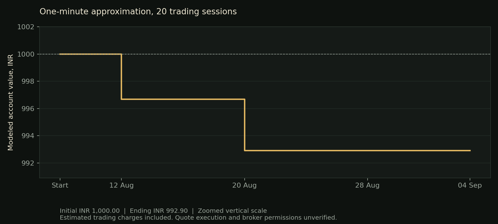

# Twenty-session minute approximation

Run locally on 5 September 2026 after approval to use the minute approximation. Evaluation covers 10 August through 4 September 2026, the latest 20 completed trading sessions. Starting investment is INR 1,000. No real orders were placed and the server was not changed.

## Result

| Measure | Result |
|---|---:|
| Initial investment | INR 1,000.00 |
| Ending modeled balance | INR 992.90 |
| Gross trading profit or loss | -INR 6.37 |
| Estimated trading charges | INR 0.73 |
| Net profit or loss | -INR 7.10 |
| Net return | -0.71% |
| Maximum realized drawdown | 0.71% |
| Completed trades | 2 |
| Winning trades | 0 |
| Losing trades | 2 |
| Rejected entry attempts | 5 |
| Sessions without a trade attempt | 13 |
| Incomplete or unresolved sessions | 0 |

The result includes modeled adverse slippage and estimated per-trade charges. Fixed API, hosting, account and data-subscription costs are excluded. No paid subscription was purchased for this run.

The chart uses a zoomed vertical scale. Drawdown is calculated from initial capital and realized balances, not continuous intraday marked equity.

## What happened

Eight opening-gap candidates appeared in the frozen daily shortlists. Five failed the permitted entry-price limit. One had already crossed its reversion target by the decision time. Two became modeled trades and both hit their stops.

The table below uses the same INR 1,000 initial account throughout. Entry and exit prices are modeled, not actual broker fills. Both entries are at 09:17 IST. Exit times identify minute intervals, not precise execution timestamps.

| Date | Stock | Side | Shares | Entry | Stop trigger | Target | Exit | Exit interval | Net profit or loss | Account after |
|---|---|---|---:|---:|---:|---:|---:|---|---:|---:|
| Aug 12 | CUPID | Short | 1 | INR 282.15 | INR 284.97 | INR 276.65 | INR 285.12 | 09:22 | -INR 3.32 | INR 996.68 |
| Aug 20 | ETERNAL | Short | 1 | INR 323.25 | INR 326.45 | INR 320.00 | INR 326.65 | 09:33 | -INR 3.78 | INR 992.90 |

CUPID loses INR 2.97 from price movement and INR 0.35 in estimated charges. ETERNAL loses INR 3.40 from price movement and INR 0.38 in estimated charges. Both losses belong to the INR 1,000 initial account above.

The ETERNAL stop exit of INR 326.65 is above the recorded high of its trigger minute. The evaluator adds fixed 0.05% adverse slippage and tick rounding to the stop trigger. That price is a hypothetical execution assumption, not a price demonstrated by the candle. The same distinction applies to all slippage-adjusted fills.

## Every session

All amounts below belong to the account that started with INR 1,000. A rejected limit attempt creates no position and has zero modeled trade PnL. It is different from an unknown or missing-data outcome.

| Date | Decision or outcome | Net profit or loss | Ending account |
|---|---|---:|---:|
| Aug 10 | CUPID entry rejected by adverse-price limit | INR 0.00 | INR 1,000.00 |
| Aug 11 | No qualifying opening gap | INR 0.00 | INR 1,000.00 |
| Aug 12 | CUPID short stopped | -INR 3.32 | INR 996.68 |
| Aug 13 | No qualifying opening gap | INR 0.00 | INR 996.68 |
| Aug 14 | No qualifying opening gap | INR 0.00 | INR 996.68 |
| Aug 17 | No qualifying opening gap | INR 0.00 | INR 996.68 |
| Aug 18 | CUPID entry rejected by adverse-price limit | INR 0.00 | INR 996.68 |
| Aug 19 | HFCL entry rejected by adverse-price limit | INR 0.00 | INR 996.68 |
| Aug 20 | ETERNAL short stopped | -INR 3.78 | INR 992.90 |
| Aug 21 | No qualifying opening gap | INR 0.00 | INR 992.90 |
| Aug 24 | ETERNAL reversion target already crossed at decision | INR 0.00 | INR 992.90 |
| Aug 25 | No qualifying opening gap | INR 0.00 | INR 992.90 |
| Aug 26 | GROWW entry rejected by adverse-price limit | INR 0.00 | INR 992.90 |
| Aug 27 | No qualifying opening gap | INR 0.00 | INR 992.90 |
| Aug 28 | No qualifying opening gap | INR 0.00 | INR 992.90 |
| Aug 31 | No qualifying opening gap | INR 0.00 | INR 992.90 |
| Sep 1 | No qualifying opening gap | INR 0.00 | INR 992.90 |
| Sep 2 | No qualifying opening gap | INR 0.00 | INR 992.90 |
| Sep 3 | No qualifying opening gap | INR 0.00 | INR 992.90 |
| Sep 4 | GROWW entry rejected by adverse-price limit | INR 0.00 | INR 992.90 |

## Fixed rules used

The strategy parameters were committed before this performance run and were not optimized after seeing its results.

- Twenty preceding completed sessions determine liquidity and coverage. Rank eligible affordable names by trailing median traded value and freeze the first five.
- Require prior price of at least INR 100, price no higher than half current account equity, and trailing median daily traded value of at least INR 50 crore.
- Use the official opening gap. Buy a gap down of at least 1%, or short a gap up of at least 1%, subject to the approximation's assumed broker permission.
- At 09:16, use the close of the completed 09:15 minute. Require at least 0.75% remaining distance toward the previous close and positive affordable whole-share quantity.
- Attempt entry using the 09:17 bar open, with 5 basis points of adverse slippage and adverse tick rounding. Reject if the modeled price is more than 0.05% adverse to the decision price.
- Do not replace a selected candidate after its entry attempt fails. Do not increase quantity beyond the amount justified at the decision time.
- Cap notional at 50% of reconciled equity and planned loss at 0.5% of equity, including estimated charges and the separate sizing allowance.
- Use a 1% stop rounded toward entry and a prior-close target rounded to the nearest valid tick. Stops and timed exits receive 5 basis points of adverse slippage. Targets require trade-through and fill at their limit.
- If a minute contains both stop and target without its open resolving order, count the stop first. Begin the timed exit at 15:00. Neither actual trade needed the timed exit.
- Estimate the monthly price tick using the previous month-end official close. Preserve missing-data failures and stop new entries after an unresolved account path.

Account equity carries forward after every realized result. It is not reset to INR 1,000 daily. After the first loss, the second trade starts from INR 996.68. There were no profits to reinvest.

The fee model uses the published Zerodha cash-intraday rates for brokerage, STT, exchange charges, SEBI fees, stamp duty, GST and IPFT. Each modeled component is rounded upward to a paisa. This is an estimate and does not reproduce contract-note aggregation or statutory rounding exactly. [Zerodha charges](https://zerodha.com/charges/)

## Interpretation

This run did not make money under the stated assumptions. It supplies no positive evidence for deploying the strategy with the INR 1,000 account.

Two trades are far too few to establish either a durable edge or a reliable expected loss. Both were shorts, so no executed long-side performance was measured. The five no-fills also show that the narrow entry limit materially affects participation. Relaxing it after seeing these results would create a different strategy requiring a separately declared test.

This is a minute-candle approximation of the proposed quote strategy. It cannot verify spreads, depth, queue access, one-second latency, historical broker permissions or all point-in-time notices. Source minute bars do not reproduce every official exchange extreme. The sample also overlaps previously inspected research data, so it is not independent forward validation. No claim of guaranteed stop execution or maximum real-world loss follows from the reported drawdown.

The [earlier data audit](../2026-09-05-pilot20/README.md) and the [original execution review](../2026-09-05-execution-review/README.md) remain available and unchanged in their findings.

## Reproduce and inspect

Run from the repository root. The public minute cache is preserved locally because the provider's historical availability can change.

    python run_intraday_pilot.py --mode minute-proxy --capital 1000 --end-date 2026-09-04 --sessions 20 --slippage-bps 5 --output results/findings/2026-09-05-pilot20-minute
    python publish_pilot_result.py
    python -m pytest -q

- [Metrics](metrics.json)
- [Compact trade ledger](trade_summary.csv)
- [Compact 20-session ledger](session_summary.csv)
- [Full decisions, fees and assumptions](daily_ledger.json)
- [Daily shortlists](daily_watchlists.csv)
- [Minute-data coverage](minute_data_coverage.csv)
- [Source hashes](data_sources.json)
- [Frozen run settings and code hashes](summary.json)

The ledger was independently checked against the cached source candles. Fifty-one automated tests pass. This run did not place orders, buy data, change the deployed dashboard or alter the strategy parameters.
